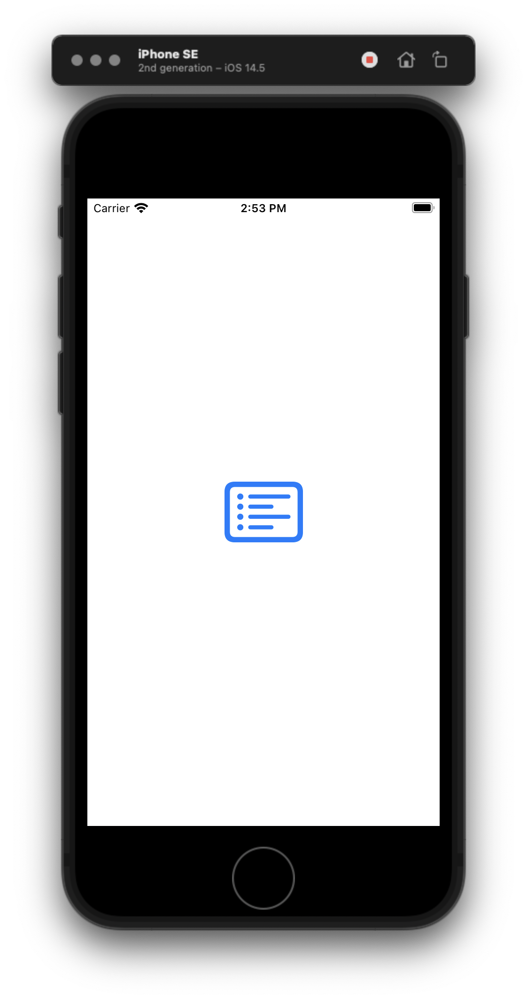
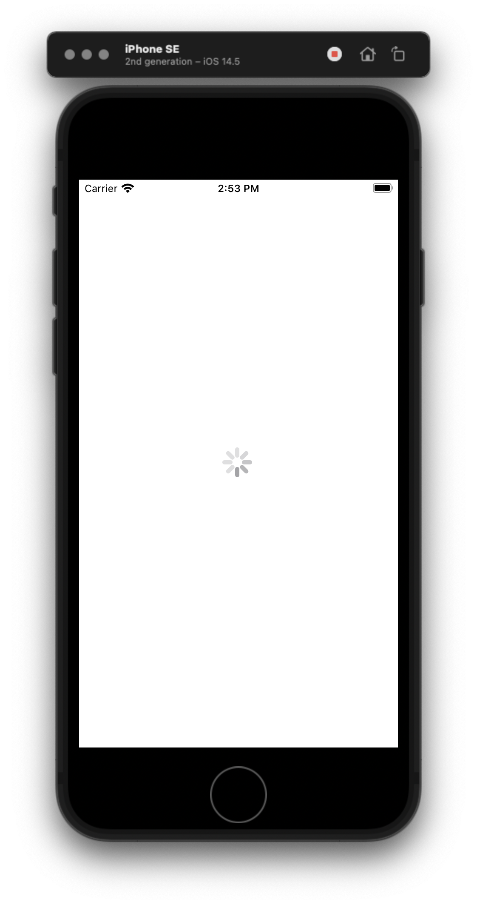
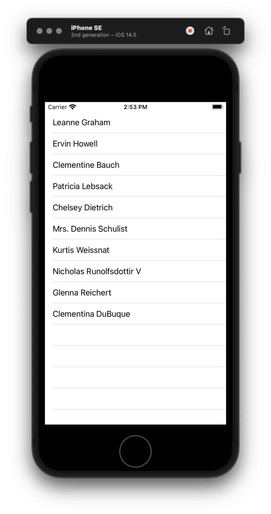

# Learn Proper VIPER

### 1. Swift: VIPER Design Pattern (Architecture, 2021, Xcode 12, Swift 5) - iOS Development
Learn basic VIPER concept using simple explanation. 
* You can check the full tutorial [here](https://www.youtube.com/watch?v=hFLdbWEE3_Y). 
* And you can check the API source [here](https://jsonplaceholder.typicode.com/users). 
&nbsp;
&nbsp;
&nbsp;
